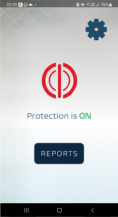

# SmishingBuster

An Android Application that fetches SMS Messages on a users phone and gives them a score from 0 to 100 on how dangerous the system deems this message in terms of it being a Phishing (Smishing) message.

## How it works?
The Analysis itself occurs on a seperate server - shown in the Backend folder.

The analysis works by tackling the problem of classifying the message from three different vectors:

- Looking for the occurences of different heuristic assumptions on phishing messages, this is facilitated by two different approaches, the one - an algorithmic approach, the other - a neural network classification approach.

- Looking for linguistic clues that points to a message being a non-safe message, this is facilitated by an MLP which is trained on the "deep-semantic-features vector", which is the hidden layer of a fine-tuned RoBERTa LM

- Checking specific links inside messages with the VirusTotal API to check if they are flagged

This analysis is compiled to a score between 0 and 100 that is presented to the user in their app.

## Screenshots

## Notes
- The RoBERTa fine-tuned model is not included in this upload (due to size), so are the training sets (due to privacy). The included "Labs" folder allows you to create the whole model if datasets are provided. The datasets paths can be found in Labs\...\paths.py

Training set dataset example:

